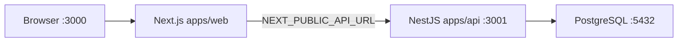

# SmartNotes — Local setup

Step-by-step guide to run the API, web app, and database on your machine.

## Prerequisites

| Tool | Version | Notes |
| ---- | ------- | ----- |
| Node.js | 20 LTS | See `.nvmrc` in repo root |
| pnpm | 9+ | `corepack enable` once |
| Docker Desktop | Latest | For PostgreSQL via `docker-compose.yml` |

## Architecture (development)



- **Web** stores JWTs in `sessionStorage` and sends `Authorization: Bearer` on protected calls.
- **API** validates JWT, scopes all note operations by `userId`.
- **CORS** allows the web origin (`CORS_ORIGIN`, default `http://localhost:3000`).

## 1. Clone and install

```bash
git clone <your-repo-url> NoteStack
cd NoteStack
corepack enable
pnpm install
```

## 2. Start PostgreSQL

```bash
docker compose up -d
```

Verify:

```bash
docker ps
```

Container `smartnotes-postgres` should be **Up**, port **5432**.

Default credentials (match `docker-compose.yml` and `.env.example`):

- User: `smartnotes`
- Password: `smartnotes`
- Database: `smartnotes_dev`

## 3. Environment files

### API — `apps/api/.env`

Copy from example:

```bash
# Unix
cp apps/api/.env.example apps/api/.env

# Windows PowerShell
Copy-Item apps\api\.env.example apps\api\.env
```

| Variable | Purpose |
| -------- | ------- |
| `PORT` | API port (default `3001`) |
| `DATABASE_URL` | Prisma connection string |
| `JWT_SECRET` | Access token signing |
| `JWT_EXPIRES_IN` | Access token TTL (e.g. `15m`) |
| `JWT_REFRESH_SECRET` | Refresh token signing |
| `JWT_REFRESH_EXPIRES_IN` | Refresh TTL (e.g. `7d`) |
| `CORS_ORIGIN` | Web origin for browser requests |

### Web — `apps/web/.env.local`

```bash
cp apps/web/.env.example apps/web/.env.local
```

| Variable | Purpose |
| -------- | ------- |
| `NEXT_PUBLIC_API_URL` | API base URL (default `http://localhost:3001/api`) |

Restart `pnpm dev:web` after changing this file.

## 4. Database migrations

```bash
pnpm --filter @smartnotes/api exec prisma migrate deploy
```

Creates `User` and `Note` tables from `apps/api/prisma/migrations`.

Optional (Prisma Studio):

```bash
pnpm --filter @smartnotes/api exec prisma studio
```

## 5. Run applications

**Option A — both (recommended)**

```bash
pnpm dev
```

**Option B — separate terminals**

```bash
pnpm dev:api   # Terminal 1 → http://localhost:3001/api
pnpm dev:web   # Terminal 2 → http://localhost:3000
```

### Verify API

```bash
# Prefer on Windows (avoids PowerShell curl alias warning)
curl.exe http://localhost:3001/api/health
```

Expected: `{"status":"ok"}`

Or:

```powershell
Invoke-RestMethod -Uri http://localhost:3001/api/health
```

### Verify web

Open http://localhost:3000 — landing page.

### First-use flow

1. Register at `/register` (password min. 8 characters).
2. Sign in at `/login` if needed.
3. Open **Notes** from the header → create notes via **New note**.

## 6. Common commands

```bash
pnpm build                              # Build api + web
pnpm lint                               # ESLint (api + web)
pnpm --filter @smartnotes/api run test  # API unit tests
pnpm --filter @smartnotes/api run test:e2e  # API e2e (needs Postgres)
pnpm --filter @smartnotes/web run lint  # Next.js lint
pnpm typecheck                          # TypeScript (where configured)
```

## Troubleshooting

| Symptom | Likely cause | Fix |
| ------- | ------------- | --- |
| `ECONNREFUSED` on register/login | Postgres or API down | `docker compose up -d`, `pnpm dev:api` |
| CORS error in browser console | Wrong `CORS_ORIGIN` | Set `http://localhost:3000` in `apps/api/.env`, restart API |
| Web cannot reach API | Wrong `NEXT_PUBLIC_API_URL` | Check `apps/web/.env.local`, restart web |
| E2E tests fail locally | DB not running | Start Docker Postgres, run `prisma migrate deploy` |
| PowerShell `curl` security prompt | `curl` is `Invoke-WebRequest` alias | Use `curl.exe` or `Invoke-RestMethod` |

## Stopping services

- Stop dev servers: `Ctrl+C` in each terminal.
- Stop Postgres container: `docker compose down` (data kept in Docker volume).

## Production notes (out of scope for local setup)

- Replace JWT secrets and use strong `DATABASE_URL`.
- Prefer HttpOnly cookies + BFF/proxy over `sessionStorage` for tokens in production.
- Run `prisma migrate deploy` in your deploy pipeline (see `.github/workflows/ci.yml`).
